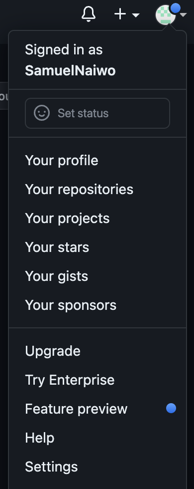

# Using SSH With GitHub

- Got to your root folder.
```commandline
cd ~
```
- Check to see if .ssh folder exists.
```commandline
cd .ssh
```
- If you don't have a .ssh folder you can create a new one.
```
mkdir .ssh
```
- Go to your .ssh folder.
```commandline
cd .ssh
```
- Create new SSH key.
```commandline
ssh-keygen -t rsa -b 4096 -C <email address>
```
- Enter the name you would like to save your key.
```commandline
Enter file in which to save the key (/Users/samuelnaiwo/.ssh/id_rsa): <ssh-key-name>
```
- Will ask you to enter your passphrase and renter again. (You can leave empty if you don't
require passphrase and press enter twice to save ssh key.)
```
Enter passphrase (empty for no passphrase): 
Enter same passphrase again: 
```
- This will show up in your terminal if completed correctly.
```commandline
Your identification has been saved in <private-key-name>
Your public key has been saved in <public-key-name>
The key fingerprint is:
SHA256:1iWnpriL9mfeYajp/Rabn38KE6z1Pni4CUZNuE0AsIg <email address>
The key's randomart image is:
+---[RSA 4096]----+
|      .....      |
|   . . .   o     |
|  E . .   o =    |
|         . %     |
|        S * *    |
|       o =.o o   |
|      . o *+oo.  |
|    .. =o++oo*o .|
|   ..oB=ooo.=+++ |
+----[SHA256]-----+
```
- You will then generate your public ssh key which will give you a long password.
```commandline
cat <ssh-key-name.pub>
```
- On your GitHub homepage, got to your settings.



- On the left hand side of your page, click on SSH and GPG keys.


- Click on the green tab titled "New SSH Key".


- Title your new ssh key. Copy and paste the long password you generated in your terminal and click the green tab "Add SSH key" when finished.


- Return back to your terminal, where you will then run background program that handles passwords for ssh private keys.
```commandline
eval `ssh-agent -s`
```
- Add your private key to your ssh register.
```commandline
ssh-add <private-ssh-key>
```
- Check to see if your private key is authenticated.
```commandline
sss -T git@github.com
```
- Create new repo on GitHub by clicking on the + sign on the top left of the page. Click new repository.


- Name your new repository you just created. You can make it public or private. Click green button "Create repository" when done.


- If you have a folder where you store your repositories, direct yourself to that folder in the terminal.

- Create a new folder the directory.
```commandline
mkdir <folder-name>
```
- Change directory into the folder you just created.
```commandline
cd <folder-name>
```
- Add a README.md file to your folder.
```commandline
touch README.md
```
- Initialize the folder you created.
```commandline
git init
```
- Add your README.file to your repository. The command below adds everything in folder for you.
```commandline
git add .
```
- Check to see what files are being tracked.
```commandline
git status
```
- Commit any changes you have made with a message for a reminder.
```
git commit -m "<message>"
```
- Rename your branch.
```commandline
git branch -M main
```
- Go back to GitHub to find your SSH link that will be used to connect your local machine to GitHub. Make sure you have selected SSH not HTTPS.

- Set the connection from your local machine to GitHub.
```commandline
git remote add origin main <ssh-link>
```
- Push changes from local machine to GitHub.
```commandline
git push -u origin main
```
